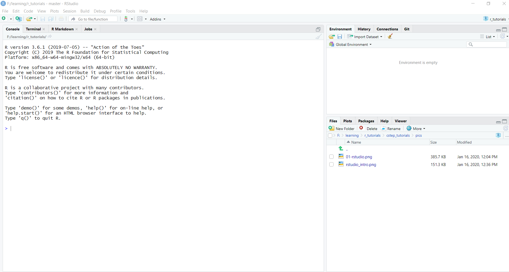
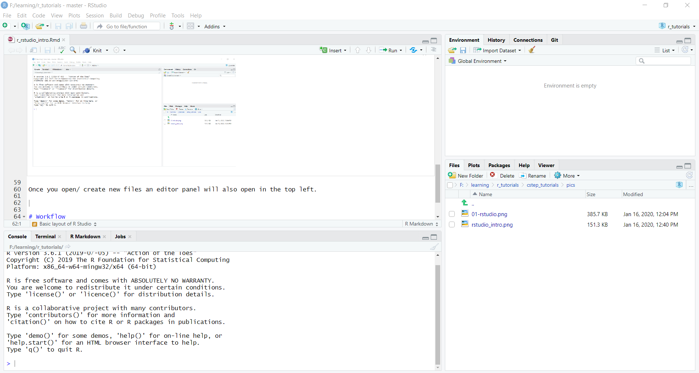

```{r setup, include=FALSE}
knitr::opts_chunk$set(echo = TRUE)
library(here)
```

# Setup

This series of tutorials assumes you have R and R Studio are installed on your computer.

The latest versions of R for can be downloaded from [here](https://cran.r-project.org/). If you are using Windows, download the _Binaries for base distribution_ from [here](https://cran.r-project.org/bin/windows/base/R-3.6.2-win.exe)

The latest version of RStudio for can be downloaded from [here](https://rstudio.com/products/rstudio/download/). Opt for _Free_ version of RStudio Desktop.

Install both R and RStudio. If you have 64 bit machine opt for 64 bit version of R.


## Getting Started

Let'start !!

Throughout this lesson, we’re going to learn some of the fundamentals of the R language as well as some best practices for organizing code for scientific projects that will make your life easier.

Our focus would be to:

* Learn how to make publication quality figures effeciently using ggplot2
* Learn how to transfrom a dataset using dplyr
* Learn how to wrangle data using readr, tidyr, dplyr, stringr, lubridate, forcats
* Use R as a programming language
* Build regression models 
* Effectively communicate results via Rmardown
* Version control using git/ GitHub and RStudio

We shall be using RStudio for this tutorial which a free, open source R integrated development environment. It provides a built in editor, works on all platforms (including on servers) and provides many advantages such as integration with version control and project management. 

## Basic layout of R Studio

When you first open RStudio, you will be greeted by three panels:

The interactive R console (entire left)
Environment/History (tabbed in upper right)
Files/Plots/Packages/Help/Viewer (tabbed in lower right)



Once you open/ create new files an editor panel will also open in the top left.




# Workflow

* Instruct RStudio not to preserve your workspace between sessions
* ```getwd()``` and ```setwd()```
* Paths and directories
* Create a new project
* Seeking Help

# Introduction to R

### Using R as a calculator

```{r}
159 + 34 * 7 / 5
(159 + 34 * 7) / 5
(159 + 34 * 7) / 5 # this is a comment
1 / 10000 # use &uarr to to to last commnd
2e3 * 3e2
```

### Mathematical fucntions

```{r}
sin(pi / 2) # trigonometry function
log(10) # logarithm base 10
log(10, base = 10) # logarithm base 10
log2(10) # logarithm base 2
exp(10) # e^10
```


### Comparing things

```{r}
10 < 4
1 == 3
1 != 7
25 > -8
```


### Variables and assignment

```{r, error = TRUE}
x <- 5 * 40 + 120
x
x <- 500
x

y <- 300

x+y

a <- "I am"
b <- "foolish"
a + b

paste(a, b)

```

The right hand side of the assignment can be any valid R expression. The right hand side is fully evaluated before the assignment occurs.

Variable names can contain letters, numbers, `_` and `.` . They cannot start with a number nor contain spaces at all. Different people use different conventions for long variable names, these include

* i_use_snake_case
* otherPeopleUseCamelCase
* some.people.use.periods
* And_aFew.People_RENOUNCEconvention

What you use is up to you, but be consistent.

It is also possible to use the = operator for assignment

```{r}
x = 5 * 40 + 120
x
x = 500
x
```

### Vectorization

```{r}
1:5
6^(1:5)
5 * (1:5)
my_vec <- c(1:5)
my_vec_multi <- 2*my_vec

seq(5)
seq(1, 5)
seq(1, 10, length.out = 5)
seq(1, 10, by = 3)

ladies <- c('Roshna', 'Shweta', 'Riya', 'Ilika', 'Krittika')
gents <- c('Nikhilesh', 'Partha')

l <- length(ladies); g <- length(gents)

print(paste("Number of ladies in climate domain is", l , 'which is more than gents\' number', g))

```

### Other Stuffs

R is case sensitive, arrow for last command in console

ls(), rm(), CRTL + L

```{r, error=TRUE}
x <- 250
X

```

# R Scripts


# R Packages

We shall be focusing on [tidyverse](https://www.tidyverse.org/) which is a collection of R packages designed for data science by [Hadley Wickham](http://hadley.nz/).

```{r eval=FALSE}
install.packages(tidyverse)
```

```{r}
library(tidyverse)
```


